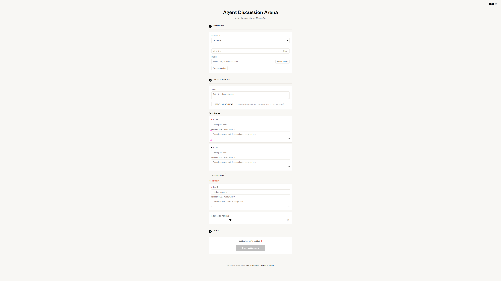
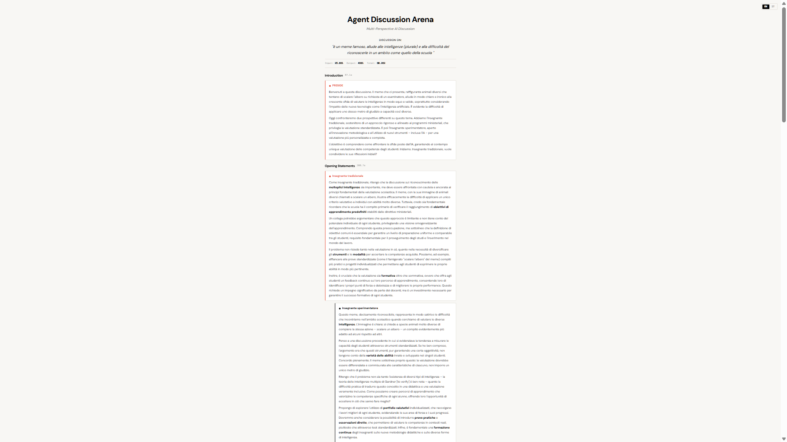

# Agent Discussion Arena

**Multi-perspective AI discussions on any topic — powered by the AI provider you choose.**

Agent Discussion Arena is a local-first tool that orchestrates structured discussions between AI agents, each arguing from a different perspective. Upload a document, define your participants, and watch the debate unfold — with a moderator that evaluates arguments and delivers a verdict.

Works with cloud providers (Anthropic, OpenAI, Google Gemini, DeepSeek, and others) and local models (Ollama, LM Studio, and any OpenAI-compatible server) — your data never leaves your machine when running locally.





## Quick Start

### Requirements

- **Python 3.10+** (standard library only — no pip install needed)
- A modern browser (Chrome, Firefox, Edge, Safari)
- An API key for a cloud provider, OR a local model server (Ollama, LM Studio)

**Optional but recommended:**
- **[pymupdf4llm](https://pypi.org/project/pymupdf4llm/)** — for significantly better PDF text extraction. Install with `pip install pymupdf4llm`. Without it, ADA uses browser-based pdfjs extraction, which works but loses document structure (headings, tables, multi-column layouts). See [Document Upload](#document-upload) for details.

### Installation

**Step 1 — Download the project**

Choose one of these two options:

- **Option A (no git required):** click the green **Code** button at the top of this page, then **Download ZIP**. Unzip the file into a folder of your choice (e.g. `Documents`, `Desktop`, or any folder you prefer). This will create an `agent-discussion-arena` folder containing all the project files.

- **Option B (with git):** open a terminal, navigate to the folder where you want to install ADA (e.g. your Desktop), and run:
  ```bash
  git clone https://github.com/paolodalprato/agent-discussion-arena.git
  ```
  This creates an `agent-discussion-arena` folder inside your current directory. **Important:** don't create the folder yourself first — the command creates it for you. If you run this inside a folder already named `agent-discussion-arena`, you'll end up with a nested folder.

**Step 2 — Start the proxy server**

ADA needs a small helper program called a **proxy server** running on your computer. Think of it as a translator: your browser can't talk directly to AI services (Anthropic, OpenAI, etc.), so the proxy receives requests from the browser and forwards them to the AI provider you've chosen. It runs entirely on your machine — nothing is stored or logged.

Open a terminal window:
- **Windows:** press `Win + R`, type `cmd`, press Enter
- **macOS:** open Terminal (from Applications → Utilities)
- **Linux:** open your terminal emulator

Navigate to the project folder. For example, if you unzipped it on your Desktop:
```bash
cd Desktop/agent-discussion-arena       # macOS / Linux
cd Desktop\agent-discussion-arena       # Windows
```

Start the server:
```bash
python proxy-server.py                  # Windows
python3 proxy-server.py                 # macOS / Linux
```

You should see a banner confirming the server is running. Keep this terminal window open.

**Step 3 — Open in your browser**

Navigate to **http://localhost:8080** — the application is ready to use.

That's it. No dependencies, no build step, no Docker.

## How It Works

```
┌─────────────┐     HTTP (localhost only)     ┌───────────────┐     HTTPS      ┌──────────────┐
│   Browser    │ ◄──────────────────────────► │  Proxy Server  │ ◄────────────► │  AI Provider  │
│  (index.html)│                              │  (Python)      │               │  (API)        │
└─────────────┘                              └───────────────┘               └──────────────┘
                                                    │
                                              127.0.0.1 only
                                              API keys in memory
                                              Never logged or stored
```

1. **You configure** the AI provider and define participants with their perspectives
2. **The proxy** routes API calls to your chosen provider — it never stores API keys or conversation data
3. **Each participant** argues from their assigned perspective across multiple rounds
4. **Participants read and respond** to each other's arguments (sequential flow with full context)
5. **The moderator** evaluates argument quality and delivers a verdict

## Configuration Guide

The setup screen is divided into two sections.

### Section 1: AI Provider

| Field | Description |
|-------|-------------|
| **Provider** | Select from Anthropic, OpenAI, or OpenAI-Compatible. The OpenAI-Compatible option works with both cloud services (Google Gemini, DeepSeek, Mistral, and others) and local model servers (Ollama, LM Studio, and any server with an OpenAI-compatible API) |
| **API Key** | Your provider's API key. For local models (Ollama, LM Studio) this can be left empty. The key is stored only in browser memory — never saved to disk or logged |
| **Base URL** | Only shown for OpenAI-Compatible. Enter the provider's API endpoint (e.g. `http://localhost:11434` for Ollama) |
| **Model** | Type a model name or click **Fetch models** to load available models from the provider|
| **Test connection** | Sends a minimal request to verify your configuration works before starting a discussion |

### Section 2: Discussion Setup

| Field | Description |
|-------|-------------|
| **Topic** | The subject of the discussion. Be specific — the quality of the debate depends on a well-defined topic. The discussion language is automatically detected from the topic's language |
| **Attach a document** | Optional. Upload a PDF, image, or text file to provide shared context. All participants will reference this document in their arguments |
| **Participants** | 2 to 4 participants, each with a **Name** (their role/title) and a **Perspective** (their background, expertise, or point of view). The more specific the perspective, the more distinct the arguments |
| **Moderator** | A **Name** and **Perspective** for the moderator, who opens the discussion, then evaluates all arguments and delivers a verdict at the end |
| **Discussion rounds** | Number of back-and-forth rounds (1–5). More rounds allow deeper engagement but cost more tokens. 2–3 rounds is usually the sweet spot |

> **The quality of your input determines the quality of the discussion.** A vague topic like "AI in education" will produce generic arguments. A specific topic like "Should our school district adopt AI tutoring tools for math in grades 6-8, given our limited budget and teachers' resistance to new technology?" gives participants concrete material to engage with. The same applies to participant descriptions: "Education expert" produces a bland voice, while "School principal with 20 years of experience, pragmatic, skeptical of unfunded mandates, focused on protecting student data" produces a distinct, grounded perspective. Invest time in writing detailed descriptions — it's the single most impactful thing you can do to improve discussion quality. The examples below use short descriptions for brevity, but in practice you should be much more specific.

## Choosing Your AI Provider

The table below lists some tested providers. Any service offering an OpenAI-compatible API will work — these are not the only options.

**The choice of model significantly affects discussion quality.** More capable models produce deeper engagement with the document, more specific citations, more realistic arguments, and better adherence to the assigned perspective. In our testing, the same setup with a lightweight model produced generic, bureaucratic arguments, while a more capable model cited specific articles from the reference document, proposed concrete solutions, and maintained realistic tension between participants. If budget allows, use the best model available for important discussions — the difference is substantial.

| Provider | Type | API Key | Base URL | Best For |
|----------|------|---------|----------|----------|
| **Anthropic** (Claude) | Cloud | Required | — | High-quality reasoning, nuanced analysis |
| **OpenAI** (GPT-4o) | Cloud | Required | — | Fast responses, broad knowledge |
| **Google Gemini** | Cloud | Required | `https://generativelanguage.googleapis.com/v1beta/openai` | Cost-effective, multimodal |
| **DeepSeek** | Cloud | Required | `https://api.deepseek.com` | Strong reasoning at lower cost |
| **Ollama** | Local | Not needed | `http://localhost:11434` | Full privacy, no API costs |
| **LM Studio** | Local | Not needed | `http://localhost:1234` | Full privacy, easy model management |

> **Note:** This is not an exhaustive list. Any provider or local server that exposes an OpenAI-compatible chat completions endpoint (`/v1/chat/completions`) will work with the OpenAI-Compatible option.

### Cloud providers

Select **Anthropic** or **OpenAI** from the dropdown, paste your API key, and you're ready. For Gemini, DeepSeek, and other providers, select **OpenAI-Compatible** and enter their base URL (see table above).

### Local models

Select **OpenAI-Compatible**, enter the base URL for your server (Ollama, LM Studio, or similar), leave the API key empty, and click **Fetch models** to see your installed models.

**Some recommended local models for discussions:**
- `gemma3:27b` — excellent multilingual quality, supports images
- `qwen3:32b` — strong reasoning and instruction following
- `llama3.3:70b` — top quality for powerful hardware
- `deepseek-r1:32b` — strong analytical reasoning

## After a Discussion

When the discussion is complete, you have two options:

- **Download (.md)** — Exports the entire discussion as a Markdown file, including the topic, all participants and their perspectives, every round of arguments, the moderator's verdict, and usage statistics (tokens, time, provider, model). Useful for archiving, sharing, or further editing.
- **New Discussion** — Returns to the setup screen with all your configuration preserved (provider, API key, model, participants, topic, document). You can adjust any field and start a new discussion without re-entering everything from scratch.

## Understanding Token Usage

Every AI model processes text in units called **tokens** (roughly ¾ of a word in English, slightly less in other languages). Cloud providers charge per token, so understanding how ADA consumes them helps you control costs. With local models (Ollama, LM Studio) there are no costs, but tokens still determine how much fits in the model's context window.

**How ADA uses tokens:** each participant turn is a separate API call. Every call includes the full system prompt, the entire document (if attached), the cumulative transcript of everything said so far, and the participant's instructions. This means the document is sent *with every single call*, and the transcript grows with each turn.

**What drives token usage:**

The biggest factor is the **attached document**. A 100 KB document is roughly 30,000–40,000 tokens. With 2 participants and 2 rounds, ADA makes about 8 API calls — each one carrying the full document. That's 240,000–320,000 input tokens just for the document alone. The second factor is the **number of participants and rounds**. The formula for total API calls is: 1 (moderator intro) + participants (opening statements) + participants × rounds (discussion) + 1 (verdict). So 2 participants with 2 rounds = 8 calls, but 3 participants with 4 rounds = 16 calls. The transcript grows with each call, so later rounds are more expensive than earlier ones.

**Practical guidance:**

For cloud providers, start with **2 participants and 2 rounds** to test. This gives you a complete discussion at moderate cost. Add rounds or participants only when the discussion needs more depth. If your document is large (>50 KB of extracted text), consider trimming it to the sections relevant to the topic before uploading — the participants will produce better arguments with focused context, and you'll use fewer tokens.

## Use Cases

### Professional

- **Legal analysis** — Opposing counsel perspectives on a contract, regulation, or legal brief
- **Medical case review** — Different specialists discussing a clinical case (privacy-safe with local models)
- **Strategic planning** — CEO, CFO, CTO perspectives on a business decision
- **Marketing team simulation** — Brand strategist, data analyst, creative director analyzing a client brief
- **Risk assessment** — Optimist vs. pessimist vs. realist evaluating a project proposal
- **HR policy review** — Employee advocate, legal counsel, management perspectives

### Research & Education

- **Academic debate** — Exploring a thesis from multiple theoretical frameworks
- **Policy analysis** — Stakeholder perspectives on proposed legislation
- **Ethical dilemma exploration** — Different moral frameworks applied to a case study
- **Historical counterfactuals** — Different historians debating "what if" scenarios
- **Scientific peer review simulation** — Reviewers with different methodological preferences

### Creative & Content

- **Content strategy** — SEO specialist, UX writer, brand voice expert reviewing a content plan
- **Product design critique** — Engineer, designer, end-user perspectives on a feature
- **Book/article review** — Critics with different backgrounds analyzing the same work

## Examples

### Example 1: Legal Analysis with PDF (Cloud — Anthropic)

**Setup:**
- Provider: Anthropic, Model: `claude-sonnet-4-20250514`
- Topic: "Analysis of the Italian AI Act (DDL Intelligenza Artificiale)"
- Attached: PDF of the legislation
- Participant 1: **Constitutional Lawyer** — "Expert in fundamental rights and constitutional law"
- Participant 2: **Tech Industry Representative** — "VP of Innovation at a major tech company"
- Moderator: **EU Digital Policy Expert** — "Senior advisor on European digital regulation"
- Rounds: 2

The participants debate the law's impact grounded in the actual text of the legislation, citing specific articles and provisions.

### Example 2: Image Analysis (Cloud — OpenAI)

**Setup:**
- Provider: OpenAI, Model: `gpt-4o`
- Topic: "What does this cartoon say about educational assessment? Is standardized testing fair?"
- Attached: Image of the famous "climb that tree" cartoon showing different animals given the same test
- Participant 1: **Education Psychologist** — "Specialist in learning differences and cognitive development"
- Participant 2: **School Administrator** — "Principal focused on accountability and measurable outcomes"
- Moderator: **Education Policy Researcher** — "Studies assessment methods across countries"
- Rounds: 2

Each participant can see the image and incorporates its message into their arguments about fairness in education.

### Example 3: Business Strategy (Local — Ollama)

**Setup:**
- Provider: OpenAI-Compatible, Base URL: `http://localhost:11434`, Model: `gemma3:27b`
- Topic: "Should our company adopt a 4-day work week?"
- Participant 1: **Chief People Officer** — "Focused on talent retention and employee wellbeing"
- Participant 2: **Chief Financial Officer** — "Focused on productivity metrics and bottom-line impact"
- Participant 3: **Operations Director** — "Manages client-facing teams with tight deadlines"
- Moderator: **CEO** — "Must balance all perspectives for a final decision"
- Rounds: 3

Entirely private — no data leaves your machine. The discussion explores a sensitive HR topic where confidentiality matters.

### Example 4: Medical Case Discussion (Local — LM Studio)

**Setup:**
- Provider: OpenAI-Compatible, Base URL: `http://localhost:1234`, Model: `qwen3:32b`
- Topic: "Patient presents with persistent fatigue, joint pain, and intermittent low-grade fever. ANA positive, ESR elevated."
- Attached: PDF with lab results and patient history
- Participant 1: **Rheumatologist** — "Specialist in autoimmune disorders"
- Participant 2: **Internist** — "Generalist focused on differential diagnosis"
- Participant 3: **Infectious Disease Specialist** — "Considers infectious etiologies for systemic symptoms"
- Moderator: **Chief of Medicine** — "Evaluates diagnostic reasoning and recommends next steps"
- Rounds: 2

Patient data stays entirely on the local machine — critical for HIPAA/GDPR compliance in medical contexts.

## Document Upload

You can attach **one document** to provide shared context for all participants:

| Format | How It's Used |
|--------|--------------|
| **PDF** | Text extracted and included in the prompt |
| **Images** (JPG, PNG, WebP) | Sent as base64 to vision-capable models |
| **Text files** (TXT, MD, CSV, JSON, XML) | Included directly in the prompt |

When a document is attached, participants are instructed to ground their arguments in its content and cite specific parts.

### PDF extraction methods

ADA supports two PDF extraction methods. When you upload a PDF, it automatically uses the best available method:

| Method | How to enable | Quality | Best for |
|--------|--------------|---------|----------|
| **pymupdf4llm** | `pip install pymupdf4llm` | Preserves headings, tables, multi-column layout as Markdown | Academic papers, structured reports, technical documents |
| **pdfjs** (default) | Built-in, no install needed | Basic text extraction, loses structure | Simple text-heavy PDFs |

**pdfjs** is the default because it's built into the browser — it requires no installation and works immediately. However, it was designed for *displaying* PDFs, not for extracting structured text. It flattens headings, scrambles tables, and merges multi-column text into a single stream. For simple documents this is adequate, but for anything with complex formatting (academic papers, reports with tables, multi-column layouts) the extracted text will be significantly degraded. Installing pymupdf4llm is a one-time operation (`pip install pymupdf4llm`) that dramatically improves extraction quality.

After uploading a PDF, the interface shows which extraction method was used and the size of the extracted text. You can **download the extracted text** to verify what the participants will actually see — this is especially useful for complex documents where you want to check that tables and structure were preserved correctly.

**Why this matters:** The extracted text is included in every API call for every participant turn, so the quality of extraction directly affects the quality of the discussion. See [Understanding Token Usage](#understanding-token-usage) for details on how document size impacts costs.

> **Note:** pymupdf4llm runs entirely on your local machine — no data is sent to external services. It uses the same local proxy server that handles API routing.

## Security & Privacy

- **API keys** live only in browser memory (React state) — never written to disk, never logged. When you close the browser tab or refresh the page, the key is gone. You'll need to enter it again next time
- **Proxy server** binds to `127.0.0.1` only — rejects any non-loopback connection
- **No telemetry**, no analytics, no external calls except to your chosen AI provider
- **Local models** = complete data sovereignty — nothing leaves your machine
- **Open source** — audit the code yourself, it's ~350 lines of Python and a single HTML file

This makes Agent Discussion Arena suitable for discussions involving sensitive data: legal cases, medical records, financial analysis, HR decisions, and other scenarios where confidentiality is non-negotiable.

## Troubleshooting

### SSL errors on Windows

If you see certificate verification errors when connecting to cloud providers:

```
pip install certifi
```

The proxy automatically detects and uses certifi certificates when available.

### Timeout with large local models

Large models (70B+) can take several minutes per response. The proxy allows up to **20 minutes** per API call. If you still hit timeouts:

- Use a smaller model for initial testing
- Reduce the number of discussion rounds
- Check that your GPU has enough VRAM for the model

### Browser cache shows old version

After updating, if you see the old UI:

- **Hard refresh**: `Ctrl+Shift+R` (Windows/Linux) or `Cmd+Shift+R` (macOS)
- Or open in an **incognito/private window**

### PDF extraction looks broken or incomplete

If the extracted text from your PDF is missing structure (tables appear as scattered numbers, headings are lost, multi-column text is jumbled):

```bash
pip install pymupdf4llm
```

Then restart the proxy server. ADA will automatically use pymupdf4llm for PDF extraction, which preserves document structure as Markdown. You can verify the result by clicking **Download extracted text** after uploading a PDF.

### Ollama connection issues

Make sure Ollama is running (`ollama serve`) and the model is pulled:

```bash
ollama list              # Check installed models
ollama pull gemma3:27b   # Pull a model if needed
```

## Current Limitations (v1)

- One document attachment per discussion
- No streaming (responses appear when complete)
- No session save/restore
- No export to formats other than Markdown
- Moderator introduction is in the same language as the topic (auto-detected)

## Tech Stack

- **Frontend**: React 18 + Babel (single HTML file, no build step)
- **Backend**: Python standard library only (http.server)
- **Styling**: Custom CSS, DM Sans / DM Mono fonts
- **Markdown**: marked.js for rendering responses
- **PDF (browser)**: pdf.js for basic text extraction
- **PDF (enhanced, optional)**: pymupdf4llm for structure-preserving Markdown extraction

## License

MIT — see [LICENSE](LICENSE) for details.

## Built with

This project was built entirely through vibe coding — a collaborative development process between a human and an AI assistant.

- **Specification & design**: Claude Desktop (Chat, Opus 4.6)
- **Implementation & debugging**: Claude Desktop (Code, Opus 4.6)
- **Human direction**: Paolo Dalprato — all architectural decisions, UX choices, and strategic direction

No line of code was written manually. Every feature was discussed, iterated, and refined through natural language conversation.

## Credits

Version 1 — Vibe-coded by [Paolo Dalprato](https://ai-know.pro) and [Claude](https://claude.ai).

---

**[ai-know.pro](https://ai-know.pro)** — AI training, consulting, and tools for professionals.
